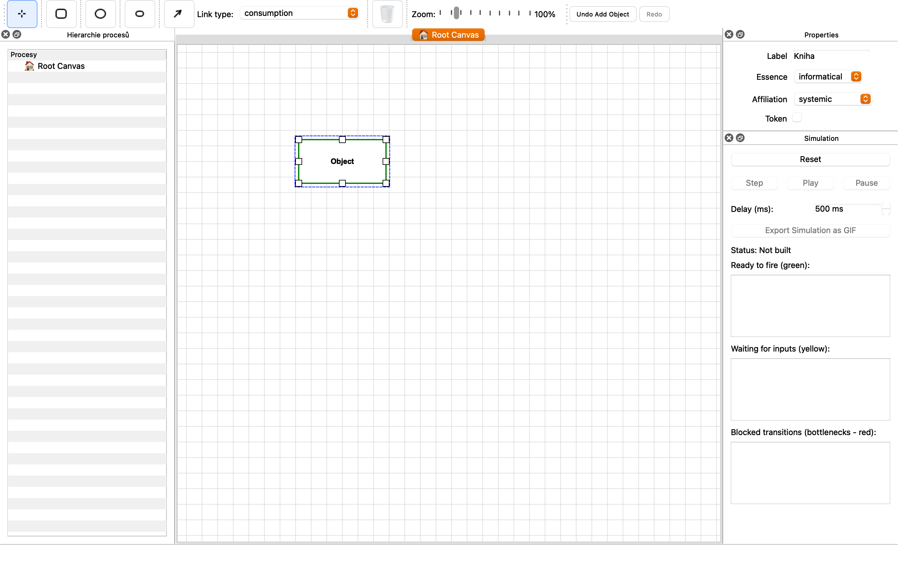

# Tutoriál pro OPM Editor

Tento dokument obsahuje text pro vytvoření vizuálního tutoriálu s obrázky. Každá sekce obsahuje instrukce pro pořízení screenshotů a popis kroků.

---

## 1. Tvorba OPD diagramu

### 1.1 Základní prvky diagramu

**Prázdné plátno**
Při otevření aplikace se otevře prázdné plátno do kterého lze umisťovat prvky z Object-Process Diagramu (dále OPD).


**Přidání objektu**
V právé horní části obrazovky naleznete Lištu nástrojů.

- ikona obdélníku: přidání objektu
- ikona elipsy: přidání procesu
- ikona menšího zaobleného obdelníku: přidání stavu

Kliknutím na tlačítko s ikonou objektu a následně na plátno přidáte objekt. Objekty jsou zobrazovány jako bez zaoblení.


**Screenshot 1.1.3: Přidání procesu**
- Klikněte na tlačítko "Process" v toolbaru
- Klikněte na plátno a vytvořte proces s názvem "Čtení knihy"
- Popisek: "Procesy jsou zobrazovány jako elipsy a reprezentují akce nebo operace."

**Screenshot 1.1.4: Přidání stavu**
- Vyberte objekt "Kniha"
- Klikněte na tlačítko "State" v toolbaru
- Klikněte na objekt "Kniha" a přidejte stav "Otevřená"
- Popisek: "Stavy se přidávají k objektům a reprezentují různé fáze nebo podmínky objektu."

**Screenshot 1.1.5: Více prvků na plátně**
- Zobrazte diagram s několika objekty: "Kniha", "Čtenář", "Knihovna"
- Zobrazte procesy: "Čtení knihy", "Půjčení knihy"
- Popisek: "Můžete vytvořit komplexní diagram s více objekty, procesy a stavy."

### 1.2 Úprava prvků

**Screenshot 1.2.1: Přesouvání prvků**
- Zobrazte režim Select (kurzor)
- Přesuňte objekt "Kniha" na jiné místo
- Popisek: "V režimu Select můžete přesouvat prvky tažením myší."

**Screenshot 1.2.2: Změna velikosti**
- Vyberte objekt "Kniha"
- Zobrazte táhla pro změnu velikosti v rozích
- Změňte velikost objektu
- Popisek: "Vybrané prvky mají táhla v rozích pro změnu velikosti."

**Screenshot 1.2.3: Properties panel**
- Vyberte objekt "Kniha"
- Zobrazte Properties panel vpravo
- Změňte label objektu na "Elektronická kniha"
- Popisek: "Properties panel umožňuje upravit vlastnosti vybraných prvků, včetně názvu."

**Screenshot 1.2.4: Smazání prvku**
- Vyberte objekt "Kniha"
- Stiskněte klávesu Delete nebo klikněte na tlačítko Delete v toolbaru
- Popisek: "Prvky lze smazat výběrem a stisknutím Delete nebo kliknutím na tlačítko Delete."

---

## 2. Strukturální vztahy

### 2.1 Agregace (Aggregation)

**Screenshot 2.1.1: Přidání agregace**
- Vytvořte objekty: "Knihovna" a "Kniha"
- Klikněte na tlačítko "Link" v toolbaru
- Klikněte na "Knihovna" a pak na "Kniha"
- V Properties panelu vyberte typ vazby "aggregation"
- Popisek: "Agregace reprezentuje vztah 'má část' - Knihovna obsahuje Knihy."

**Screenshot 2.1.2: Agregační ikona**
- Zobrazte detail vazby s diamantovou ikonou uprostřed
- Popisek: "Agregace je zobrazována diamantovou ikonou uprostřed vazby."

**Screenshot 2.1.3: Kardinalita agregace**
- Vyberte vazbu agregace
- V Properties panelu nastavte kardinalitu zdroje "1" a cíle "1..*"
- Zobrazte kardinality na vazbě
- Popisek: "Kardinality určují, kolik instancí může být ve vztahu. '1..*' znamená jedna nebo více."

### 2.2 Exhibice (Exhibition)

**Screenshot 2.2.1: Přidání exhibice**
- Vytvořte objekty: "Kniha" a "Autor"
- Přidejte vazbu mezi nimi
- V Properties panelu vyberte typ "exhibition"
- Popisek: "Exhibice reprezentuje vztah 'má atribut' - Kniha má Autora."

**Screenshot 2.2.2: Exhibiční ikona**
- Zobrazte detail vazby s čtvercovou ikonou uprostřed
- Popisek: "Exhibice je zobrazována čtvercovou ikonou uprostřed vazby."

### 2.3 Generalizace (Generalization)

**Screenshot 2.3.1: Přidání generalizace**
- Vytvořte objekty: "Kniha" a "Elektronická kniha"
- Přidejte vazbu od "Elektronická kniha" k "Kniha"
- V Properties panelu vyberte typ "generalization"
- Popisek: "Generalizace reprezentuje vztah 'je typem' - Elektronická kniha je typem Knihy."

**Screenshot 2.3.2: Generalizační ikona**
- Zobrazte detail vazby s trojúhelníkovou ikonou
- Popisek: "Generalizace je zobrazována trojúhelníkovou ikonou směřující k obecnějšímu objektu."

### 2.4 Instanciace (Instantiation)

**Screenshot 2.4.1: Přidání instanciace**
- Vytvořte objekty: "Šablona knihy" a "Konkrétní kniha"
- Přidejte vazbu mezi nimi
- V Properties panelu vyberte typ "instantiation"
- Popisek: "Instanciace reprezentuje vztah 'je instancí' - Konkrétní kniha je instancí Šablony knihy."

**Screenshot 2.4.2: Instanciační ikona**
- Zobrazte detail vazby s kruhovou ikonou uprostřed
- Popisek: "Instanciace je zobrazována kruhovou ikonou uprostřed vazby."

---

## 3. Procedurální vztahy

### 3.1 Consumption (Spotřeba)

**Screenshot 3.1.1: Přidání consumption vazby**
- Vytvořte objekt "Kniha" a proces "Čtení knihy"
- Klikněte na tlačítko "Link"
- Klikněte na objekt "Kniha" a pak na proces "Čtení knihy"
- V Properties panelu vyberte typ "consumption"
- Popisek: "Consumption reprezentuje, že proces spotřebovává objekt. Proces Čtení knihy spotřebovává Knihu."

**Screenshot 3.1.2: Consumption šipka**
- Zobrazte detail vazby s procedurální šipkou směřující k procesu
- Popisek: "Consumption je zobrazována procedurální šipkou směřující od objektu k procesu."

### 3.2 Result (Výsledek)

**Screenshot 3.2.1: Přidání result vazby**
- Vytvořte proces "Čtení knihy" a objekt "Přečtená kniha"
- Přidejte vazbu od procesu k objektu
- V Properties panelu vyberte typ "result"
- Popisek: "Result reprezentuje, že proces vytváří objekt. Proces Čtení knihy vytváří Přečtenou knihu."

**Screenshot 3.2.2: Result šipka**
- Zobrazte detail vazby s procedurální šipkou směřující od procesu
- Popisek: "Result je zobrazována procedurální šipkou směřující od procesu k objektu."

### 3.3 Effect (Efekt)

**Screenshot 3.3.1: Přidání effect vazby**
- Vytvořte proces "Čtení knihy" a objekt "Znalost"
- Přidejte vazbu mezi nimi
- V Properties panelu vyberte typ "effect"
- Popisek: "Effect reprezentuje, že proces ovlivňuje objekt. Proces Čtení knihy ovlivňuje Znalost."

**Screenshot 3.3.2: Effect šipky**
- Zobrazte detail vazby s procedurálními šipkami na obou koncích
- Popisek: "Effect je zobrazována procedurálními šipkami na obou koncích vazby."

### 3.4 Agent (Agent)

**Screenshot 3.4.1: Přidání agent vazby**
- Vytvořte objekt "Čtenář" a proces "Čtení knihy"
- Přidejte vazbu od objektu k procesu
- V Properties panelu vyberte typ "agent"
- Popisek: "Agent reprezentuje, že objekt provádí proces. Čtenář provádí proces Čtení knihy."

**Screenshot 3.4.2: Agent kruh**
- Zobrazte detail vazby s vyplněným kruhem blízko procesu
- Popisek: "Agent je zobrazován vyplněným kruhem blízko procesu."

### 3.5 Instrument (Nástroj)

**Screenshot 3.5.1: Přidání instrument vazby**
- Vytvořte objekt "Brýle" a proces "Čtení knihy"
- Přidejte vazbu od objektu k procesu
- V Properties panelu vyberte typ "instrument"
- Popisek: "Instrument reprezentuje, že objekt je nástrojem procesu. Brýle jsou nástrojem procesu Čtení knihy."

**Screenshot 3.5.2: Instrument kruh**
- Zobrazte detail vazby s prázdným kruhem blízko procesu
- Popisek: "Instrument je zobrazován prázdným kruhem blízko procesu."

### 3.6 Komplexní procedurální diagram

**Screenshot 3.6.1: Kompletní procedurální diagram**
- Zobrazte diagram s:
  - Objekty: "Čtenář", "Kniha", "Znalost"
  - Proces: "Čtení knihy"
  - Vazby: agent (Čtenář → Čtení), consumption (Kniha → Čtení), effect (Čtení ↔ Znalost)
- Popisek: "Komplexní procedurální diagram ukazující všechny typy procedurálních vztahů."

---

## 4. Import a export diagramu z JSON a export obrázku

### 4.1 Export do JSON

**Screenshot 4.1.1: Menu Export**
- Zobrazte menu "Export" v toolbaru
- Klikněte na "Export to JSON"
- Popisek: "Export menu umožňuje uložit diagram do JSON formátu."

**Screenshot 4.1.2: Dialog pro uložení**
- Zobrazte dialog pro uložení souboru
- Zadejte název "moj_diagram.json"
- Popisek: "Vyberte umístění a název pro JSON soubor."

**Screenshot 4.1.3: Ověření exportu**
- Otevřete vytvořený JSON soubor v textovém editoru
- Zobrazte strukturu s nodes a links
- Popisek: "JSON soubor obsahuje kompletní strukturu diagramu včetně všech uzlů a vazeb."

### 4.2 Import z JSON

**Screenshot 4.2.1: Menu File**
- Zobrazte menu "File" v toolbaru
- Klikněte na "Open JSON"
- Popisek: "Menu File umožňuje načíst diagram z JSON souboru."

**Screenshot 4.2.2: Dialog pro otevření**
- Zobrazte dialog pro výběr souboru
- Vyberte "moj_diagram.json"
- Popisek: "Vyberte JSON soubor, který chcete načíst."

**Screenshot 4.2.3: Načtený diagram**
- Zobrazte načtený diagram v editoru
- Popisek: "Diagram byl úspěšně načten a zobrazen v editoru."

### 4.3 Export obrázku

**Screenshot 4.3.1: Export jako obrázek**
- Zobrazte menu "Export"
- Klikněte na "Export as Image" nebo "Export as SVG"
- Popisek: "Export menu umožňuje uložit diagram jako obrázek (PNG) nebo vektorový formát (SVG)."

**Screenshot 4.3.2: Dialog pro uložení obrázku**
- Zobrazte dialog pro uložení
- Zadejte název "diagram.png" nebo "diagram.svg"
- Popisek: "Vyberte formát a umístění pro exportovaný obrázek."

**Screenshot 4.3.3: Exportovaný obrázek**
- Zobrazte exportovaný obrázek v prohlížeči obrázků
- Popisek: "Diagram byl úspěšně exportován jako obrázek."

---

## 5. Zoom-in do procesu

### 5.1 Vytvoření procesu s podprocesy

**Screenshot 5.1.1: Hlavní proces**
- Zobrazte diagram s procesem "Správa knihovny"
- Zobrazte objekty: "Knihovna", "Kniha", "Čtenář"
- Popisek: "Proces 'Správa knihovny' na hlavní úrovni diagramu."

**Screenshot 5.1.2: Přidání podprocesů**
- Dvakrát klikněte na proces "Správa knihovny"
- Nebo vyberte proces a použijte kontextové menu
- Popisek: "Dvojitým kliknutím na proces se otevře zoom-in do procesu."

**Screenshot 5.1.3: Nový tab s podprocesy**
- Zobrazte nový tab "🔍 Správa knihovny"
- Zobrazte prázdný canvas pro podprocesy
- Popisek: "Otevře se nový tab s názvem procesu, kde můžete přidat podprocesy a objekty."

**Screenshot 5.1.4: Vytvoření podprocesů**
- V novém tabu vytvořte podprocesy: "Půjčení knihy", "Vrácení knihy"
- Vytvořte objekty: "Půjčená kniha", "Čtenář"
- Popisek: "V zoom-in režimu můžete vytvářet podprocesy a objekty, které jsou součástí hlavního procesu."

### 5.2 Navigace mezi úrovněmi

**Screenshot 5.2.1: Hierarchy panel**
- Zobrazte Hierarchy panel (pokud je dostupný)
- Zobrazte stromovou strukturu procesů
- Popisek: "Hierarchy panel zobrazuje hierarchickou strukturu všech procesů v diagramu."

**Screenshot 5.2.2: Navigace zpět**
- Zobrazte tlačítko "Back to Parent" nebo "Out-zoom" v toolbaru
- Klikněte na něj
- Popisek: "Tlačítko 'Back to Parent' vás vrátí na nadřazenou úroveň diagramu."

**Screenshot 5.2.3: Přepínání mezi taby**
- Zobrazte více tabů: "🏠 Root Canvas" a "🔍 Správa knihovny"
- Klikněte mezi taby
- Popisek: "Můžete přepínat mezi různými úrovněmi diagramu pomocí tabů."

### 5.3 Komplexní hierarchie

**Screenshot 5.3.1: Víceúrovňová hierarchie**
- Zobrazte diagram s:
  - Root: "Správa knihovny" (proces)
  - Zoom-in 1: "Půjčení knihy" (proces), "Vrácení knihy" (proces)
  - Zoom-in 2: V zoom-in "Půjčení knihy" vytvořte "Ověření čtenáře" (proces)
- Popisek: "Můžete vytvářet víceúrovňové hierarchie procesů."

**Screenshot 5.3.2: Hierarchie v panelu**
- Zobrazte Hierarchy panel s rozbalenou strukturou
- Popisek: "Hierarchy panel zobrazuje celou hierarchickou strukturu s možností navigace."

---

## 6. Zobrazení OPL a jeho import

### 6.1 Generování OPL z diagramu

**Screenshot 6.1.1: Properties panel s OPL**
- Vyberte libovolný prvek (objekt, proces nebo vazbu)
- Zobrazte Properties panel
- Zobrazte sekci "OPL Preview" nebo podobnou
- Popisek: "Properties panel automaticky generuje OPL (Object Process Language) reprezentaci vybraného prvku."

**Screenshot 6.1.2: OPL pro objekt**
- Vyberte objekt "Kniha"
- Zobrazte OPL kód: `Kniha.`
- Popisek: "Objekty jsou v OPL reprezentovány jako podstatná jména s tečkou."

**Screenshot 6.1.3: OPL pro proces**
- Vyberte proces "Čtení knihy"
- Zobrazte OPL kód: `Čtení knihy.`
- Popisek: "Procesy jsou v OPL reprezentovány jako slovesa s tečkou."

**Screenshot 6.1.4: OPL pro vazbu**
- Vyberte vazbu consumption mezi "Kniha" a "Čtení knihy"
- Zobrazte OPL kód: `Čtení knihy consumes Kniha.`
- Popisek: "Vazby jsou v OPL reprezentovány jako věty popisující vztah mezi prvky."

**Screenshot 6.1.5: Kompletní OPL diagramu**
- Zobrazte menu nebo tlačítko pro zobrazení celého OPL
- Zobrazte dialog s kompletním OPL kódem pro celý diagram
- Popisek: "Můžete zobrazit kompletní OPL reprezentaci celého diagramu."

### 6.2 Export OPL

**Screenshot 6.2.1: Export OPL dialog**
- Zobrazte menu "Export" nebo "OPL"
- Klikněte na "Export OPL" nebo "Show OPL"
- Popisek: "Export menu umožňuje zobrazit a exportovat OPL kód."

**Screenshot 6.2.2: OPL preview dialog**
- Zobrazte dialog s OPL kódem
- Zobrazte tlačítko "Copy" nebo "Save"
- Popisek: "OPL preview dialog zobrazuje kompletní OPL kód s možností kopírování nebo uložení."

**Screenshot 6.2.3: Uložení OPL**
- Klikněte na "Save" a uložte jako "diagram.opl"
- Popisek: "OPL kód lze uložit do textového souboru."

### 6.3 Import OPL

**Screenshot 6.3.1: Import OPL menu**
- Zobrazte menu "File" nebo "Import"
- Klikněte na "Import OPL" nebo "Load OPL"
- Popisek: "Menu umožňuje načíst diagram z OPL kódu."

**Screenshot 6.3.2: OPL import dialog**
- Zobrazte dialog pro vložení nebo načtení OPL kódu
- Vložte příklad OPL kódu:
```
Kniha.
Čtenář.
Čtení knihy.
Čtení knihy consumes Kniha.
Čtenář handles Čtení knihy.
```
- Popisek: "OPL import dialog umožňuje vložit nebo načíst OPL kód ze souboru."

**Screenshot 6.3.3: Načtený diagram z OPL**
- Zobrazte diagram vytvořený z OPL kódu
- Zobrazte objekty, procesy a vazby
- Popisek: "Diagram byl úspěšně vytvořen z OPL kódu."

---

## 7. Využití GPT pro OPL předgenerování

### 7.1 Otevření NL to OPL dialogu

**Screenshot 7.1.1: Menu pro NL to OPL**
- Zobrazte menu "AI" nebo "Tools"
- Klikněte na "NL to OPL" nebo "Generate from Text"
- Popisek: "Menu umožňuje generovat OPL kód z přirozeného jazyka pomocí AI."

**Screenshot 7.1.2: NL to OPL dialog**
- Zobrazte dialog pro zadání textu
- Zobrazte textové pole pro vstup
- Popisek: "Dialog umožňuje zadat popis systému v přirozeném jazyce."

### 7.2 Generování OPL z textu

**Screenshot 7.2.1: Zadání textu**
- V dialogu zadejte příklad textu:
  "Knihovna má knihy a čtenáře. Čtenář může půjčit knihu. Proces půjčení knihy spotřebovává knihu a vytváří půjčenou knihu."
- Zobrazte tlačítko "Generate" nebo "Convert"
- Popisek: "Zadejte popis systému v přirozeném jazyce."

**Screenshot 7.2.2: Generování v průběhu**
- Zobrazte indikátor načítání nebo "Generating..."
- Popisek: "Systém zpracovává text pomocí AI a generuje OPL kód."

**Screenshot 7.2.3: Vygenerovaný OPL**
- Zobrazte vygenerovaný OPL kód v dialogu:
```
Knihovna.
Kniha.
Čtenář.
Půjčení knihy.
Půjčení knihy consumes Kniha.
Půjčení knihy yields Půjčená kniha.
```
- Zobrazte tlačítko "Import" nebo "Use"
- Popisek: "AI vygeneruje OPL kód na základě zadaného textu."

### 7.3 Import vygenerovaného OPL

**Screenshot 7.3.1: Import do diagramu**
- Klikněte na tlačítko "Import" v dialogu
- Popisek: "Kliknutím na Import se vygenerovaný OPL načte do diagramu."

**Screenshot 7.3.2: Vytvořený diagram**
- Zobrazte diagram vytvořený z AI generovaného OPL
- Zobrazte objekty: "Knihovna", "Kniha", "Čtenář"
- Zobrazte proces: "Půjčení knihy"
- Zobrazte vazby
- Popisek: "Diagram byl automaticky vytvořen z AI generovaného OPL kódu."

**Screenshot 7.3.3: Úprava vygenerovaného diagramu**
- Zobrazte možnost úpravy vytvořeného diagramu
- Přesuňte prvky nebo přidejte další
- Popisek: "Vygenerovaný diagram můžete dále upravovat podle potřeby."

---

## 8. Práce s Petriho sítí

### 8.1 Konverze OPM diagramu na Petriho síť

**Screenshot 8.1.1: Simulation panel**
- Zobrazte Simulation panel (pokud je dostupný)
- Nebo menu "Simulation" nebo "Petri Net"
- Popisek: "Simulation panel umožňuje pracovat s Petriho sítí."

**Screenshot 8.1.2: Konverze diagramu**
- Zobrazte tlačítko "Convert to Petri Net" nebo "Generate Petri Net"
- Klikněte na něj
- Popisek: "Kliknutím na tlačítko se OPM diagram převede na Petriho síť."

**Screenshot 8.1.3: Petriho síť zobrazení**
- Zobrazte převedenou Petriho síť
- Zobrazte místa (places) a přechody (transitions)
- Popisek: "OPM objekty se převádějí na místa, procesy na přechody."

### 8.2 Simulace Petriho sítě

**Screenshot 8.2.1: Tokeny v Petriho síti**
- Zobrazte Petriho síť s tokeny
- Zobrazte tokeny v místech
- Popisek: "Tokeny reprezentují stav systému v Petriho síti."

**Screenshot 8.2.2: Spuštění simulace**
- Zobrazte tlačítko "Play" nebo "Start Simulation"
- Klikněte na něj
- Popisek: "Simulace spustí tok tokenů přes síť."

**Screenshot 8.2.3: Průběh simulace**
- Zobrazte animaci nebo kroky simulace
- Zobrazte pohyb tokenů
- Popisek: "Simulace zobrazuje průběh toku tokenů přes přechody."

**Screenshot 8.2.4: Kontrola simulace**
- Zobrazte tlačítka "Pause", "Stop", "Step"
- Zobrazte možnost krokování simulace
- Popisek: "Můžete simulaci pozastavit, zastavit nebo krokovat krok po kroku."

### 8.3 Analýza Petriho sítě

**Screenshot 8.3.1: Vlastnosti Petriho sítě**
- Zobrazte informace o Petriho síti
- Zobrazte počet míst, přechodů, tokenů
- Popisek: "Simulation panel zobrazuje vlastnosti Petriho sítě."

**Screenshot 8.3.2: Reachability graf**
- Pokud je dostupný, zobrazte reachability graf
- Popisek: "Reachability graf ukazuje všechny dosažitelné stavy sítě."

---

## 9. Důležité upozornění

### 9.1 Beta verze a známé problémy

**Screenshot 9.1.1: Upozornění v README**
- Zobrazte sekci s upozorněním
- Text: "⚠️ DŮLEŽITÉ UPOZORNĚNÍ - BETA VERZE"
- Popisek: "Aplikace je v beta verzi a může obsahovat chyby."

**Screenshot 9.2.1: Undo/Redo upozornění**
- Zobrazte tlačítka Undo/Redo v toolbaru
- Zobrazte upozornění: "Undo a Redo funkce nejsou doporučeny k použití v této verzi."
- Popisek: "Undo a Redo funkce mohou způsobovat neočekávané chování a nejsou doporučeny."

**Screenshot 9.3.1: Seznam známých problémů**
- Zobrazte seznam známých problémů:
  - "Undo/Redo může způsobit nestabilitu"
  - "Některé funkce mohou vykazovat chyby"
  - "Export/Import může mít problémy s komplexními diagramy"
  - "Zoom-in funkce může mít problémy s velkými hierarchiemi"
- Popisek: "Seznam známých problémů a omezení beta verze."

**Screenshot 9.4.1: Doporučení pro uživatele**
- Zobrazte doporučení:
  - "Pravidelně ukládejte práci (Export to JSON)"
  - "Vyhněte se použití Undo/Redo"
  - "Při problémech restartujte aplikaci"
  - "Hlaste chyby vývojářům"
- Popisek: "Doporučení pro bezpečné používání beta verze."

---

## Shrnutí funkcí

**Screenshot Shrnutí: Kompletní diagram**
- Zobrazte komplexní diagram obsahující:
  - Více objektů: "Knihovna", "Kniha", "Čtenář", "Autor"
  - Více procesů: "Správa knihovny", "Půjčení knihy", "Čtení knihy"
  - Stavy: "Otevřená", "Zavřená" (u objektu Kniha)
  - Strukturální vztahy: agregace, exhibice, generalizace
  - Procedurální vztahy: consumption, result, effect, agent, instrument
- Popisek: "Kompletní OPM diagram demonstrující všechny funkce editoru."

---

## Klávesové zkratky

**Screenshot Klávesové zkratky: Tabulka**
- Zobrazte tabulku klávesových zkratek:
  - `Ctrl+A` - Označit vše
  - `Ctrl+C` - Kopírovat
  - `Ctrl+V` - Vložit
  - `Ctrl+D` - Duplikovat
  - `Delete` - Smazat vybrané
  - `Ctrl+Wheel` - Zoom
  - `Double Click` - Zoom-in do procesu
- Popisek: "Přehled klávesových zkratek pro rychlejší práci."

---

## Tipy a triky

**Screenshot Tipy: Rady**
- Zobrazte seznam tipů:
  - "Použijte mřížku pro zarovnání prvků"
  - "Properties panel umožňuje rychlou úpravu vlastností"
  - "Hierarchy panel usnadňuje navigaci v komplexních diagramech"
  - "Export do JSON pravidelně pro zálohu"
  - "AI generování OPL může urychlit vytváření diagramů"
- Popisek: "Užitečné tipy pro efektivní práci s editorem."

---

**Konec tutoriálu**

Tento text slouží jako návod pro pořízení screenshotů. Každý screenshot by měl být doplněn o popisek a případně o číslování pro snadnou orientaci v dokumentaci.

